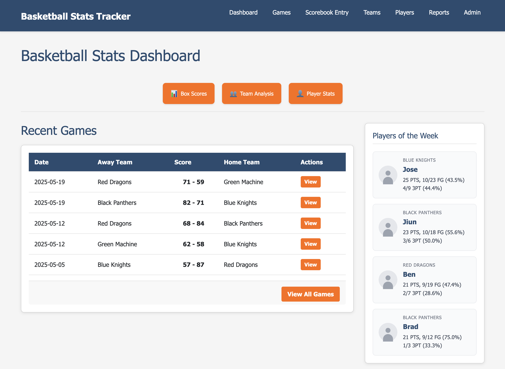

# Basketball Stats Tracker

A comprehensive basketball statistics management system designed for small leagues and teams. Track game performance, manage rosters, and generate detailed reports through both web interface and command-line tools.



<!-- PROJECT_STATS_START -->
## 📊 Project Statistics

| Metric | Value |
|--------|-------|
| **Tests** | 932 total (881 ✅ passed, 1 ❌ failed, 28 ⏭️ skipped, 22 ⚠️ errors) |
| **Test Files** | 100 files (67 unit, 28 integration, 5 functional) |
| **Code Coverage** | 54% (4,289 / 7,943 executable lines) |
| **Source Code** | 95 Python files (20k total LOC) |
| **Dependencies** | 41 total (core + dev/test) |
| **Python Version** | 3.11+ |
| **Code Quality** | Ruff linting + pytest |
| **License** | MIT |
| **Version** | 0.4.31 |

<!-- PROJECT_STATS_END -->


## Features

### Game Management
- **Live Game Entry**: Real-time statistics entry during games via web interface
- **Scorebook Entry**: Traditional paper scorebook data entry with CSV import
- **Game Reports**: Detailed box scores and performance analytics
- **Historical Data**: Track season-long statistics and trends

### Data Management
- **Team & Player Management**: Organize rosters with detailed player information
- **CSV Import/Export**: Bulk data operations for rosters and game statistics
- **Data Validation**: Automatic error checking and duplicate prevention
- **Season Statistics**: Automatic calculation of cumulative stats

### Interfaces
- **Web UI**: Modern web interface accessible at http://localhost:8000
- **Command Line**: Full-featured CLI for automation and advanced users
- **Standalone App**: No installation required - download and run
- **API Access**: REST API for custom integrations

## Installation

Choose the installation method that works best for you:

### Option 1: Web Application (Recommended)

Run the full web application with database:

```bash
# Using Docker (easiest)
git clone https://github.com/highwayoflife/basketball-stats-tracker.git
cd basketball-stats-tracker
make run
```

Access the web interface at **http://localhost:8000**

### Option 2: Standalone Download

Download and run without any installation:

1. Download the latest release from the [Releases page](https://github.com/highwayoflife/basketball-stats-tracker/releases)
2. Extract the ZIP file
3. Run the application:
   - **Windows**: Double-click `start.bat`
   - **macOS/Linux**: Run `./start.sh` in Terminal

### Option 3: Python Package

For Python users (version 3.11+):

```bash
pip install basketball-stats-tracker
basketball-stats init-db
```

## Getting Started

### 1. Using the Web Interface

After installation, access the web interface at **http://localhost:8000**

**Main Features:**
- **Dashboard**: View recent games and team statistics
- **Games**: Create new games and enter live statistics
- **Teams & Players**: Manage rosters and player information
- **Reports**: Generate box scores and season statistics

**Quick Workflow:**
1. Navigate to **Teams** → Add your teams and players
2. Go to **Games** → Create a new game
3. Use **Live Entry** for real-time scoring or **Scorebook Entry** for post-game data
4. View **Reports** for game summaries and statistics

### 2. Importing Data via CSV

Bulk import rosters and game data using CSV files:

**Player Roster Format:**
```csv
team_name,player_name,jersey_number
Warriors,Stephen Curry,30
Warriors,Klay Thompson,11
Lakers,LeBron James,23
```

**Game Statistics Format:**
```csv
Home,Team A
Visitor,Team B
Date,2025-05-15
Team,Jersey Number,Player Name,Fouls,QT1,QT2,QT3,QT4
Team A,10,Player One,2,22-1x,3/2,11,
Team A,23,Player Two,3,12,x,-/,22
```

**Shot String Format:**
- `2` = Made 2-pointer | `-` = Missed 2-pointer
- `3` = Made 3-pointer | `/` = Missed 3-pointer
- `1` = Made free throw | `x` = Missed free throw

Example: `22-1x` = 2 made 2-pointers, 1 missed 2-pointer, 1 made free throw, 1 missed free throw

## Advanced Usage

For command-line usage, API integration, and development setup, see:

- **[Developer Guide](docs/development.md)** - CLI commands, development setup, testing
- **[Design Document](docs/design_doc.md)** - Technical architecture and database schema
- **[Substitute Players Guide](docs/substitute_players_guide.md)** - Managing players who play for multiple teams

## Support

For issues, questions, or feature requests:
- **GitHub Issues**: [Report bugs or request features](https://github.com/highwayoflife/basketball-stats-tracker/issues)
- **Documentation**: Check the [Developer Guide](docs/development.md) for detailed usage
